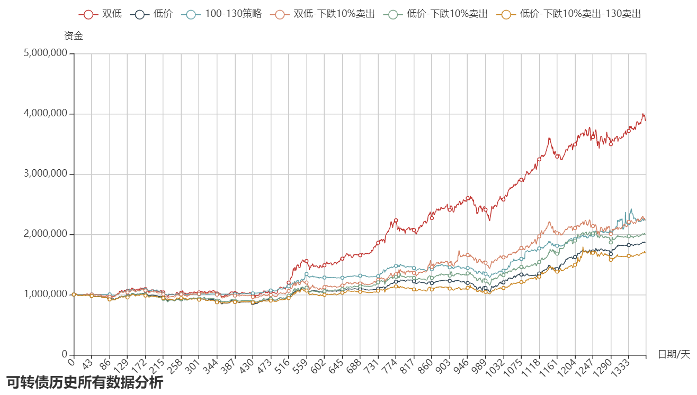
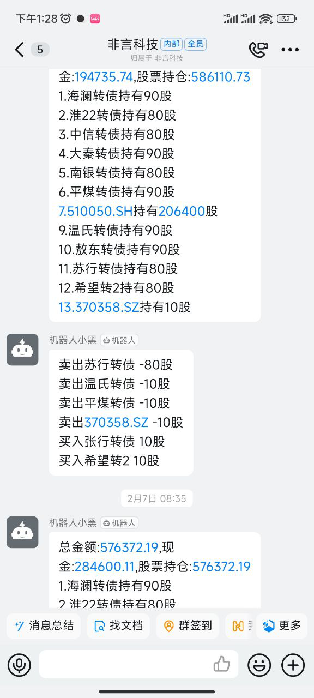

# 数字化可转债研究

项目地址：https://github.com/ZGarry/myKeZhuanZhai

重磅更新！现在支持**实盘可转债**操作了。

## 项目图片

## 背景
可转债的数字化研究越来越重要，但是数据的缺失、框架的缺失，让这种研究推进速度并非那么如意。
本工程旨在构建一套数字化研究可转债的方案。

可转债最重要的，也就两件事情：

一构建一套完整的下单机制。（能买入，能卖出）

二合适的策略。（需要数据、需要回测）

## 代码参考

工程框架：python3 + Flask(后端) + jquey + Bootstrap(前端)
个人文档位置：https://www.yuque.com/zfjz/petotc/fzy0f9

## 阶段目标一：一套完整的回测框架
- [X] 完成回测基本框架
- [X] 完善绘图框架 Paint
- [X] 支持不同回测模式；添加缓存
- [X] 完善类关系；将内容工程化；
- [X] 从 miniqmt 获取数据

## 阶段目标二：实盘
- [X] 接入miniqmt
- [x] 接入钉钉消息
- [x] 接入集思录数据
- [X] 按比例实盘
- [X] 策略调整
- [X] 代码优化